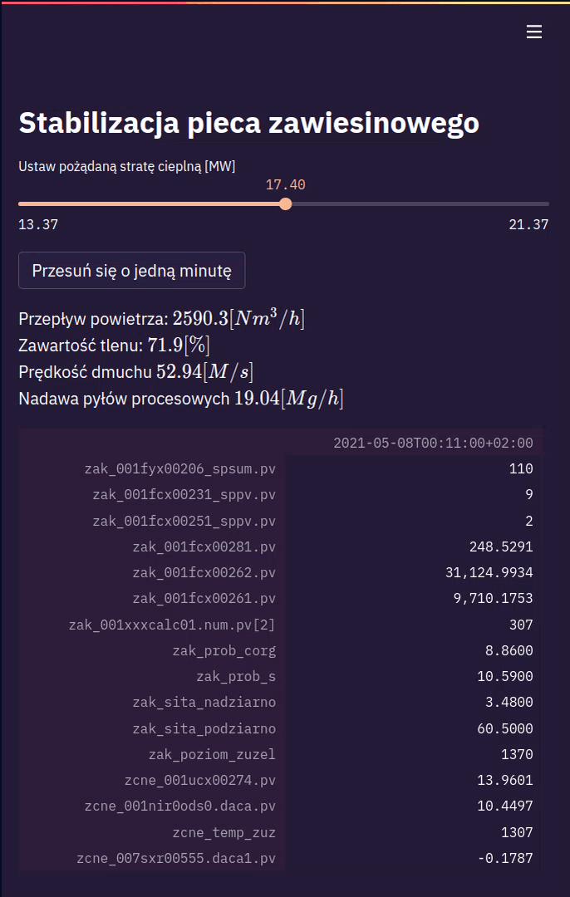
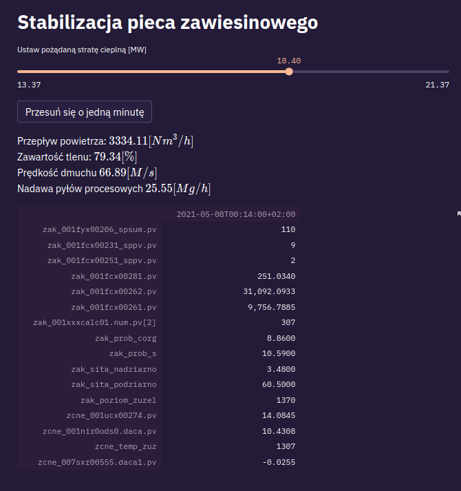

# panoramix
Panoramix - Projekt Stabilizacji Pieca na hackathon CU Valley KGHM, czerwiec 2021

## Co to jest?

Projekt składa się z dwóch części:
1. notebooków w których prowadzona była analiza danych i trenowanie algorytmów uczenia maszynowego.
2. aplikacji opartej o streamlit która pozwala zastosować wyuczony model w praktyce.

Do uruchomienia obu tych części potrzebne jest środowisko języka Python. Projekt zawiera listę niezbędnych zależności (zarówno wysokopoziomowych w pliku requirements.in jak i szczegółowych w pliku requirements.txt).

Dla sprawniejszej nawigacji w projekcie dodany został plik Makefile z pomocą którego można zainstalować zależności `make install` jak i uruchomić środowisko notebookowe (`make notebook`) i/lub finalną aplikacje `make app`.

Zalecamy korzystanie z pythonowego środowiska wirtualnego :)

## Zrzut ekranu z aplikacji
 
 

